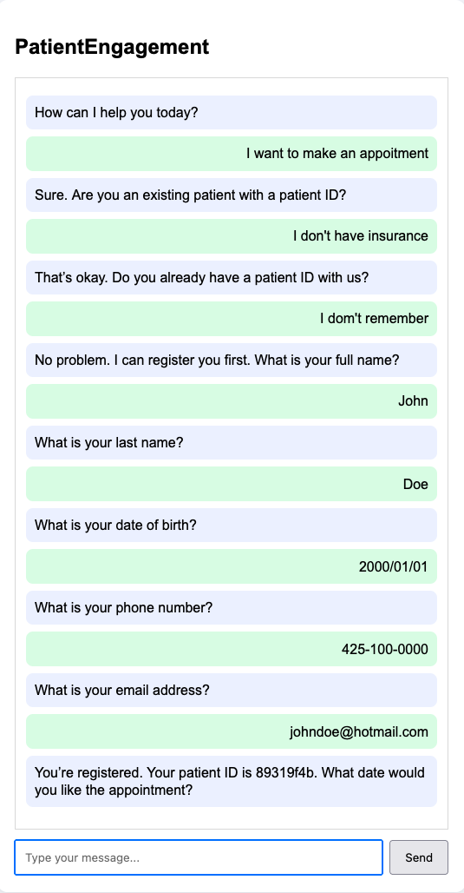

# PatientEngagement AI Agent

PatientEngagement is an Agentic AI-powered healthcare assistant that helps patients with:

* Patient Registration
* Insurance Management
* Appointment Scheduling
* Appointment Rescheduling
* Appointment Cancellation

The application uses OpenAI Function Calling to allow the LLM to determine the patient's intent and automatically invoke the appropriate backend tool.

---

## Features

### Registration

Register new patients by collecting:

* First Name
* Last Name
* Date of Birth
* Phone Number
* Email Address

### Insurance Management

Add or update insurance information:

* Insurance Provider
* Member ID
* Group Number

### Appointment Management

* Schedule appointments
* Reschedule appointments
* Cancel appointments
* View appointments

### Agentic AI Workflow

Instead of hard-coded routing logic, the AI agent:

1. Understands the patient's request
2. Determines the appropriate action
3. Collects missing information
4. Invokes backend tools
5. Returns a user-friendly response

---

## Architecture

```text
Browser UI
    |
    v
Flask Web Application
    |
    v
PatientEngagement Agent
    |
    +--> Registration Tool
    |
    +--> Insurance Tool
    |
    +--> Appointment Tool
    |
    v
OpenAI LLM (Function Calling)
```

---

## Demo Screenshot



---

## Example Conversation

```text
PatientEngagement:
How can I help you today?

User:
I want to make an appointment

PatientEngagement:
Sure. Are you an existing patient with a patient ID?

User:
I don't remember

PatientEngagement:
No problem. I can register you first. What is your full name?

User:
John Doe

PatientEngagement:
What is your date of birth?

User:
2000/01/01

PatientEngagement:
What is your phone number?

User:
425-100-0000

PatientEngagement:
What is your email address?

User:
johndoe@hotmail.com

PatientEngagement:
You're registered. Your patient ID is 89319f4b.
What date would you like the appointment?
```

---

## Project Structure

```text
patient-engagement/
│
├── app.py
├── agent.py
├── config.py
├── tools.py
├── tool_schemas.py
├── store.py
│
├── templates/
│   └── index.html
│
├── static/
│   ├── app.js
│   └── style.css
│
└── screenshots/
    └── patient-engagement-demo.png
```

---

## Installation

### Create Virtual Environment

```bash
python3 -m venv venv
source venv/bin/activate
```

### Install Dependencies

```bash
pip install flask openai
```

### Configure OpenAI API Key

```bash
export OPENAI_API_KEY="your_api_key"
```

---

## Run Application

```bash
python app.py
```

Open your browser:

```text
http://127.0.0.1:5000
```

---

## Technology Stack

* Python
* Flask
* OpenAI API
* HTML
* CSS
* JavaScript

---

## Future Enhancements

* Patient lookup integration
* Insurance eligibility verification
* Appointment availability search
* SMS notifications
* Email notifications
* Contact preference management
* Healthcare portal integration
* Electronic Health Record (EHR) integration

---

## Disclaimer

This application is intended for demonstration and educational purposes.

It does not provide medical advice, diagnosis, or treatment recommendations. For medical emergencies, call 911 or visit the nearest emergency room.
